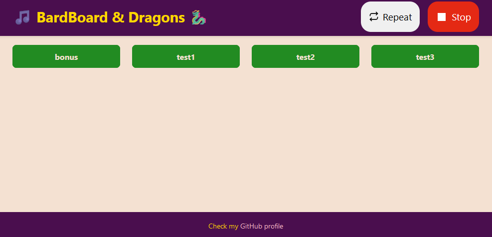

# BardBoard & Dragons

A simple Discord soundboard bot that enhances your D&D sessions (or whatever you like) with atmospheric sounds and music. Built with JavaScript and featuring a clean, Bootstrap-powered web interface:

Simply click any button on the interface to play the corresponding sound in your Discord channel – perfect for adding ambiance or just making some noise!

## Table of Contents
- [Overview](#overview)
- [Prerequisites](#prerequisites)
- [Setup Guide](#setup-guide)
  - [Docker Installation](#docker-installation)
  - [Manual Installation](#manual-installation)
- [Roadmap](#roadmap)
- [Contributors](#contributors)
- [License](#license)
- [Credits](#credits)

## Overview

BardBoard & Dragons started as a passion project to enhance D&D sessions with immersive audio. Now it's available for anyone looking to add atmospheric sounds to their gaming experience. This guide will walk you through setting up your own instance of BardBoard.

## Prerequisites

Choose your preferred installation method:

**Docker Container (Recommended)**
- Docker installed on your system

**Manual Installation**
- Node.js 22.11.0+
- npm 10.9.0+
- Key dependencies:
  - express 4.21.1+
  - discord.js 14.15.3+
  - @discordjs/voice: 0.17.0+
  - @discordjs/opus: 0.9.0+
  - libsodium-wrappers 0.7.13+
  - dotenv 16.4.5+

## Setup Guide

Before installation, you'll need to configure your environment:

1. Create a `.env` file (you can duplicate `.env.sample`)
2. Add your Discord credentials:
   - Discord Bot Token ([guide to generate it](https://www.writebots.com/discord-bot-token/))
   - Discord [Channel ID](https://support.discord.com/hc/en-us/articles/206346498-Where-can-I-find-my-User-Server-Message-ID#h_01HRSTXPS5FMK2A5SMVSX4JW4E) (enable [developer mode](https://support.discord.com/hc/en-us/articles/206346498-Where-can-I-find-my-User-Server-Message-ID#h_01HRSTXPS5CRSRTWYCGPHZQ37H) first)

### Docker Installation

1. Run `docker compose up --build -d` and wait for the container creation
2. The `audio-files` and `public` folders are volume-mounted for real-time updates
3. Access the interface at [localhost:3000](http://localhost:3000)
4. Add or remove audio files as needed (only .mp3 at the moment) – just refresh the page to see your changes

### Manual Installation

1. Ensure all prerequisites are met
2. Run `npm install` or `npm ci`
3. Launch with `node BardBoard.js`
4. Access the interface at [localhost:3000](http://localhost:3000)
5. Add or remove audio files as needed (only .mp3 at the moment) – just refresh the page to see your changes

## Known Issues

The `@discordjs/opus` package is affected by [CVE-2024-21521 vulnerability](https://security.snyk.io/vuln/SNYK-JS-DISCORDJSOPUS-6370643). Since this bot is self-hosted and will be accessible only from the local network, we can safely ignore this DoS vulnerability. If you have something in mind to solve it, just submit a PR.

## Roadmap

Coming soon:
- Song name shown
- Extended audio format support
- More customization options
- Improve frontend (...maybe :D)
- Any idea you can have: just PM me or open a PR.

## Contributors

- **Giovanbattista Abbate** - [GitHub Profile](https://github.com/giabb)

## License

Released under the GNU GPL 3.0 License. See [LICENSE.md](LICENSE.md) for details.

## Credits

README template inspired by [PurpleBooth](https://github.com/PurpleBooth)