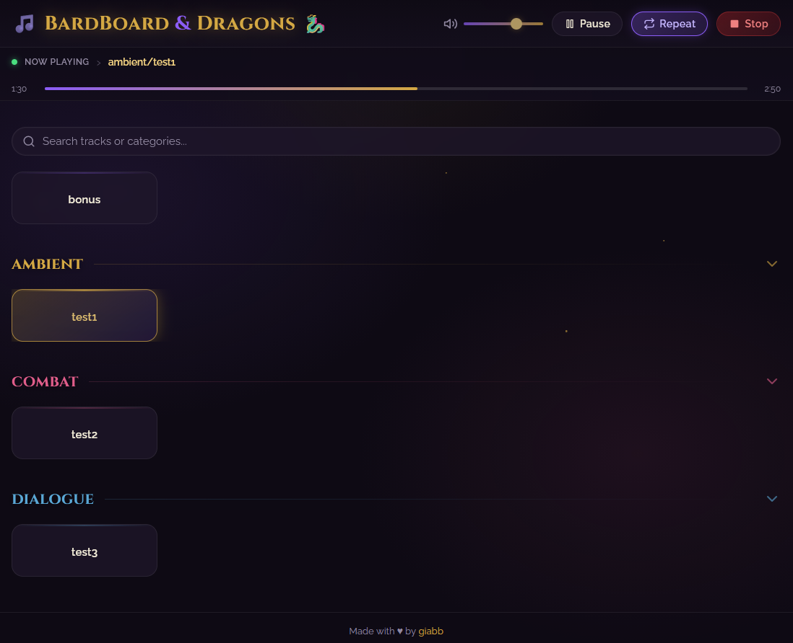

# BardBoard & Dragons

**A Discord soundboard with a browser UI.**

BardBoard lets you play sound effects, music, and voice lines into a Discord voice channel from a clean web interface. It is designed for tabletop sessions, watch parties, and any server where quick audio cues are useful.

[](LICENSE.md)
[](https://github.com/giabb/BardBoard/actions/workflows/ci.yml)



## Contents

- [Quick Start](#quick-start)
- [Features](#features)
- [Requirements](#requirements)
- [Discord Bot Setup](#discord-bot-setup)
- [Run With Docker](#run-with-docker)
- [Run Locally](#run-locally)
- [Adding Sounds](#adding-sounds)
- [Using BardBoard](#using-bardboard)
- [Configuration](#configuration)
- [Troubleshooting](#troubleshooting)
- [Development](#development)
- [Contributing](#contributing)
- [License](#license)

## Quick Start

After creating and inviting a [Discord bot](#discord-bot-setup), start BardBoard
from the repository root:

```bash
docker compose up --build -d --wait
```

Open `http://localhost:3000`, enter the bot token and admin credentials on the
setup page, then save. The containers restart automatically when required.

## Features

- Browser-based soundboard for Discord voice channels.
- One-click playback with volume, pause/resume, stop, repeat, and seeking.
- Playlist queue with drag-and-drop ordering.
- Drag tracks into the playlist to queue them.
- Upload audio from the browser by browsing or dragging files into the upload modal.
- Organize tracks into categories.
- Drag tracks between categories to move files on disk.
- Create categories manually or by dragging a track to the "New Category" drop zone.
- Rename or delete tracks and categories from the UI.
- Required admin authentication with an optional readonly account.
- First-run setup page: no manual `.env` file is required for Docker.
- Swagger UI at `/api-docs`.

## Requirements

For the normal Docker setup:

- Docker Desktop or Docker Engine with Docker Compose.
- A Discord bot token.
- A Discord server where you can invite the bot.

For local development without Docker:

- Node.js 24.
- `ffmpeg` available in your `PATH`.
- Platform audio dependencies required by Discord voice packages.

## Discord Bot Setup

1. Create a Discord application in the [Discord Developer Portal](https://discord.com/developers/applications).
2. Create a bot and copy its token.
3. In **OAuth2 -> URL Generator**, select the `bot` scope.
4. Give the bot at least **Connect** and **Speak** permissions.
5. Open the generated invite URL and add the bot to your server.

Keep the bot token private. Do not commit it.

## Run With Docker

The Docker setup does not require a host `.env` file. On first start, BardBoard creates a config file inside the Docker volume `bardboard-config` and sends you to the setup page.

1. Clone or download this repository.
2. Open a terminal in the project folder.
3. Start the app:

```bash
docker compose up --build -d --wait
```

4. Open `http://localhost:3000`.
5. Complete the first-run setup page:
   - Discord bot token.
   - Admin username.
   - Admin password.
   - Optional readonly user.
6. Save and restart when prompted.

After setup, configuration is stored in the named Docker volume:

```text
bardboard-config:/usr/src/app/config
```

Audio files and sessions are mounted from the project folder:

```text
./audio-files -> /usr/src/app/audio-files
./sessions    -> /usr/src/app/sessions
```

The production image runs as the unprivileged `node` user (UID/GID `1000`) and
both services enable a small init process plus `no-new-privileges`. On Linux,
make sure the bind-mounted directories are writable before the first start:

```bash
mkdir -p audio-files sessions
sudo chown -R 1000:1000 audio-files sessions
```

Only the bot container reads the optional host `.env`; the web container receives
only its proxy URL and port, so Discord tokens and login credentials are not copied
into the public-facing process environment.

### Optional Docker `.env`

A host `.env` file is optional. Compose uses it for deployment values and the bot
can use its values to seed a missing config volume. Explicit deployment values
(`WEB_PORT`, `BOT_PORT`, `BACKEND_URL`, `UPLOAD_MAX_MB`, and the container session
path) take precedence over stale values in the persisted file. For bot credentials
and other application settings, the persisted config volume remains authoritative;
change them from the admin UI after first-run setup.

Example:

```env
WEB_PORT=3000
BOT_PORT=3001
UPLOAD_MAX_MB=50
SESSION_HOST_DIR=./sessions
```

`SESSION_HOST_DIR` selects the directory on the Docker host. Inside the bot
container it is always mounted at `/usr/src/app/sessions`; keep the application
setting `SESSION_DIR=./sessions` when using Docker. `BACKEND_URL` is configured
automatically by Compose and normally should not be overridden.

If you change a port or `SESSION_HOST_DIR`, recreate the containers. Changes to
`UPLOAD_MAX_MB` also require rebuilding the web image because Next.js reads the
proxy upload limit during its production build:

```bash
docker compose up --build -d --wait
```

### Docker Health, Recovery, and Logs

Both services have health checks and restart automatically after a crash or host
restart. The bot handles `SIGTERM`/`SIGINT` by stopping HTTP traffic, Discord audio,
FFmpeg processes, voice connections, and the Discord client before exiting.

```bash
docker compose ps
docker compose restart bard-board-bot
docker compose logs -f --tail=200
```

Docker JSON logs rotate at `10 MB`, retaining three files per service, so an
unattended installation cannot grow a single container log indefinitely.

### Remote Access and HTTPS

The default Compose setup publishes only the web UI; the bot/API port remains on
the internal Docker network. Do not publish the bot/API port directly.

`http://localhost:3000` is suitable for access from the Docker host. If BardBoard
is reachable from another machine or from the internet, place it behind an HTTPS
reverse proxy and restrict access with a firewall or private network. Login
credentials and session cookies must not travel over an unencrypted public
connection.

### Updating the Docker Deployment

Back up the persisted data before an update, then fetch the new code and recreate
the services from a freshly pulled base image:

```bash
git pull --ff-only
docker compose build --pull
docker compose up -d --wait
docker compose ps
```

After confirming that both services are healthy, old unused images can be removed
manually with `docker image prune` if disk space is needed.

### Backup and Restore Docker Data

The config backup contains the Discord token and account credentials. Keep the
`backups` directory private; it is excluded from Git. For a consistent backup,
briefly stop both services and copy the named volume plus bind-mounted data.

PowerShell:

```powershell
$BackupDir = "backups/$(Get-Date -Format yyyyMMdd-HHmmss)"
$SessionHostDir = "./sessions" # Match SESSION_HOST_DIR when customized.
New-Item -ItemType Directory -Force "$BackupDir/config" | Out-Null
docker compose stop
try {
    docker compose cp bard-board-bot:/usr/src/app/config/. "$BackupDir/config"
    Copy-Item audio-files "$BackupDir/audio-files" -Recurse -Force
    if (Test-Path $SessionHostDir) { Copy-Item $SessionHostDir "$BackupDir/sessions" -Recurse -Force }
} finally {
    docker compose start
}
```

Bash:

```bash
set -e
BACKUP_DIR="backups/$(date +%Y%m%d-%H%M%S)"
SESSION_HOST_DIR="./sessions" # Match SESSION_HOST_DIR when customized.
mkdir -p "$BACKUP_DIR/config"
docker compose stop
trap 'docker compose start' EXIT
docker compose cp bard-board-bot:/usr/src/app/config/. "$BACKUP_DIR/config"
cp -a audio-files "$BACKUP_DIR/audio-files"
if [ -d "$SESSION_HOST_DIR" ]; then cp -a "$SESSION_HOST_DIR" "$BACKUP_DIR/sessions"; fi
docker compose start
trap - EXIT
```

Restore only from a trusted backup. Check that both the configuration and audio
directories exist before stopping BardBoard. The following commands replace the
current audio, sessions, and persisted configuration.

PowerShell:

```powershell
$BackupDir = "backups/20260904-120000" # Select an existing backup explicitly.
$SessionHostDir = "./sessions" # Match SESSION_HOST_DIR when customized.
if (!(Test-Path "$BackupDir/config") -or !(Test-Path "$BackupDir/audio-files")) {
    throw "The selected backup is incomplete: $BackupDir"
}
docker compose down --volumes
if (Test-Path audio-files) { Remove-Item audio-files -Recurse -Force }
Copy-Item "$BackupDir/audio-files" audio-files -Recurse -Force
if (Test-Path $SessionHostDir) { Remove-Item $SessionHostDir -Recurse -Force }
if (Test-Path "$BackupDir/sessions") { Copy-Item "$BackupDir/sessions" $SessionHostDir -Recurse -Force }
if (!(Test-Path $SessionHostDir)) { New-Item -ItemType Directory -Force $SessionHostDir | Out-Null }
docker compose create bard-board-bot
docker compose cp "$BackupDir/config/." bard-board-bot:/usr/src/app/config
docker compose run --rm --no-deps --user root bard-board-bot chown -R node:node /usr/src/app/config
docker compose up -d --wait
```

Bash:

```bash
set -e
BACKUP_DIR="backups/20260904-120000" # Select an existing backup explicitly.
SESSION_HOST_DIR="./sessions" # Match SESSION_HOST_DIR when customized.
if [ ! -d "$BACKUP_DIR/config" ] || [ ! -d "$BACKUP_DIR/audio-files" ]; then
  echo "The selected backup is incomplete: $BACKUP_DIR" >&2
  exit 1
fi
docker compose down --volumes
rm -rf audio-files "$SESSION_HOST_DIR"
cp -a "$BACKUP_DIR/audio-files" audio-files
if [ -d "$BACKUP_DIR/sessions" ]; then cp -a "$BACKUP_DIR/sessions" "$SESSION_HOST_DIR"; fi
mkdir -p "$SESSION_HOST_DIR"
docker compose create bard-board-bot
docker compose cp "$BACKUP_DIR/config/." bard-board-bot:/usr/src/app/config
docker compose run --rm --no-deps --user root bard-board-bot chown -R node:node /usr/src/app/config
sudo chown -R 1000:1000 audio-files "$SESSION_HOST_DIR"
docker compose up -d --wait
```

Run `docker compose ps` afterwards and confirm both services report `healthy`.

### Reset Docker First-Run Setup

This deletes the persisted BardBoard config volume. Audio files and sessions use
bind mounts and are not removed by this command.

```bash
docker compose down --volumes
docker compose up --build -d --wait
```

## Run Locally

Local development also supports first-run setup. If `.env` is missing, the backend creates one in the project root and the web UI redirects to `/setup`.

1. Install dependencies:

```bash
npm ci
```

2. Start the bot/API and web app:

```bash
npm run dev
```

3. Open `http://localhost:3000`.
4. Complete the setup page if prompted.

You can also copy `.env.sample` to `.env` and pre-fill values manually.

## Adding Sounds

Supported formats:

- MP3
- WAV
- OGG
- M4A

You can add sounds in two ways.

### Browser Upload

Click **Add Song**, then drag files into the upload modal or browse for files. You can:

- Upload multiple files at once.
- Remove files from the pending upload list.
- Choose an existing category.
- Create a new category during upload.
- See upload progress.

### Manual Files

Put audio files in `audio-files/` and refresh the page.

Use first-level folders for categories:

```text
audio-files/
  Tavern.mp3
  Intro.ogg
  Combat/
    Clash.mp3
    Bash.wav
    Roar.ogg
  NPCs/
    Merchant.mp3
    Guard.mp3
```

This creates root tracks plus `Combat` and `NPCs` sections in the UI.

## Using BardBoard

Open the web UI, select a Discord voice channel, then click a track.

### Soundboard Grid

- Click a track to play it immediately.
- Use the mini buttons on each track to add to playlist, rename, or delete.
- Drag tracks between categories to move the underlying audio file.
- Drag tracks to the playlist to queue them without moving the file.

### Categories

- Categories can be expanded and collapsed.
- Rename or delete categories from the category header.
- Drag a track to another category to move it.
- Drag a track to **New Category** to create a category and move the track into it.

### Header Controls

- Select the Discord voice channel.
- Adjust volume.
- Mute and restore volume.
- Pause/resume.
- Repeat the current track.
- Stop playback.
- Seek within the current track using the progress bar.

### Playlist

- Queue tracks from the soundboard.
- Drag tracks into the playlist panel.
- Reorder queued tracks with drag and drop.
- Shuffle, clear, play queue, or skip.

### Settings

The settings page is available to admins. It shows editable runtime configuration values. Changes that affect bot login, auth, rate limits, or sessions require a restart.

## Configuration

BardBoard reads configuration from:

- Docker: `/usr/src/app/config/.env` by default, persisted in the `bardboard-config` volume.
- Local development: `./.env` by default.
- Custom path: set `BARDBOARD_ENV_PATH`.
- Process environment variables, used as defaults when generating a missing config file.
- Explicit deployment environment values for ports, proxying, uploads, and the
  container session path, which take precedence over persisted values.

`SESSION_HOST_DIR` is a Docker Compose variable rather than an application setting,
so it is not shown or edited by the BardBoard settings page.

The setup page requires:

- `DISCORD_TOKEN`
- `AUTH_ADMIN_USER`
- `AUTH_ADMIN_PASS`

`AUTH_READONLY_USER` and `AUTH_READONLY_PASS` are optional.

| Variable | Required | Default | Description | Apply method |
|---|---:|---|---|---|
| `DISCORD_TOKEN` | Yes | empty | Discord bot token. | Restart |
| `AUTH_ADMIN_USER` | Yes for setup | empty | Admin username. | Restart |
| `AUTH_ADMIN_PASS` | Yes for setup | empty | Admin password. | Restart |
| `AUTH_READONLY_USER` | No | empty | Optional readonly username. | Restart |
| `AUTH_READONLY_PASS` | No | empty | Optional readonly password. | Restart |
| `SESSION_SECRET` | Recommended | generated | Session signing secret. | Restart |
| `LOGIN_REMEMBER_DAYS` | No | `30` | Remember-me cookie duration. | Restart |
| `SESSION_DIR` | No | `./sessions` | Application session path. Keep `./sessions` in Docker. | Restart |
| `SESSION_HOST_DIR` | No | `./sessions` | Docker host directory mounted for session persistence. | Recreate containers |
| `NOISES_FOLDER` | No | `!noises` | Category folder used for overlay noises. | Restart |
| `NOISES_VOLUME` | No | `2` | Overlay noise gain (`1` = original level, `2` = double amplitude; range `0`-`10`). | Restart |
| `RATE_LIMIT_AUDIO` | No | `120` | Requests/minute for audio actions. | Restart |
| `RATE_LIMIT_FILES` | No | `60` | Requests/minute for file actions. | Restart |
| `RATE_LIMIT_AUDIO_STATUS` | No | `600` | Requests/minute for status polling. | Restart |
| `RATE_LIMIT_PLAYLIST` | No | `120` | Requests/minute for playlist actions. | Restart |
| `CORS_ORIGINS` | No | empty | Comma-separated allowed origins. | Restart |
| `SESSION_FILE_RETRIES` | No | `5` | Session file-store retry attempts. | Restart |
| `SESSION_FILE_RETRY_FACTOR` | No | `1` | Session file-store retry backoff factor. | Restart |
| `SESSION_FILE_RETRY_MIN_MS` | No | `50` | Minimum session retry delay in ms. | Restart |
| `SESSION_FILE_RETRY_MAX_MS` | No | `200` | Maximum session retry delay in ms. | Restart |
| `SESSION_WRITE_RETRIES` | No | `6` | Extra retries for transient file-lock races. | Restart |
| `WEB_PORT` | No | `3000` | Web UI port. | Recreate containers |
| `BOT_PORT` | No | `3001` | Bot/API port. | Recreate containers |
| `BACKEND_URL` | No | `http://localhost:3001` | Next.js API proxy target; Compose sets it automatically. | Restart locally; Docker-managed |
| `UPLOAD_MAX_MB` | No | `50` | Max upload size per file in MB. | Rebuild containers |
| `BARDBOARD_ENV_PATH` | No | varies | Path to the config file. Docker sets this automatically. | Restart |

## Troubleshooting

### The app opens `/setup` even though I have a `.env`

Docker does not rely on the project-root `.env` for persisted app configuration. It writes setup values to the `bardboard-config` volume at `/usr/src/app/config/.env`.

If you want to reset Docker setup, remove the config volume as shown in [Reset Docker First-Run Setup](#reset-docker-first-run-setup).

### Nothing plays

- Make sure the bot is invited to your server.
- Make sure the bot has **Connect** and **Speak** permissions.
- Select a voice channel in the BardBoard header.
- Check logs:

```bash
docker compose logs -f
```

### The bot is not online

- Check the Discord token in setup/settings.
- Restart the bot container:

```bash
docker compose restart bard-board-bot
```

### The soundboard is empty

- Add supported audio files to `audio-files/`.
- Refresh the page.
- Use first-level subfolders only for categories.

### Login does not work

- Use the admin credentials configured during first-run setup.
- If credentials were changed, old sessions may no longer be valid.
- Restart after changing auth-related settings.

### API docs

- Swagger UI: `http://localhost:3000/api-docs`
- Raw OpenAPI JSON: `http://localhost:3000/api-docs.json`

## Development

Useful commands:

```bash
npm ci
npm run dev
npm run build
npm run start
npm run lint
npm test
npm audit --omit=dev --audit-level=high
```

Use `npm install` instead when intentionally adding, removing, or updating a
dependency so that npm can update `package-lock.json`.

### Automated Tests

Run the bot API test suite with:

```bash
npm test
```

The tests send real HTTP requests to temporary local Express servers and replace
Discord voice primitives with in-memory test doubles. They cover audio controls,
playback state, authentication and permissions, CORS, file and category management,
uploads, configuration, channel switching, and playlist behavior without requiring a
Discord token, a voice channel, `ffmpeg`, or a running application.

Generate a source coverage report with:

```bash
npm run test:coverage
```

The coverage command also enforces minimum project-wide thresholds of 90% for
lines, 70% for branches, and 85% for functions. The CI fails if a change drops
below any of these gates. Process-lifecycle tests exercise production restart and
graceful signal handling, while filesystem and concurrency tests cover atomic
config writes, partial uploads, simultaneous uploads, file mutations, playlists,
and session creation.

Run the Chromium end-to-end tests with:

```bash
npx playwright install chromium
npm run test:e2e
```

The end-to-end suite builds and starts the real Next.js application, then checks
login, persistent sessions and logout, first-boot setup, settings permissions and
validation, voice-channel selection, playback, audio upload/rename/move/delete flows,
playlist reordering and commands, and visible API error feedback in a browser. Most
Discord API responses are intercepted for determinism; a dedicated smoke test instead
uses Next.js's real proxy and an isolated Express server with a fake Discord channel.
No real bot token or Discord connection is required. Ports `3001` and `3100` must be
available while the end-to-end suite runs.

Validate the production Docker deployment with:

```bash
npm run test:docker
```

This smoke test validates the Compose configuration, builds the production image,
starts the API and web containers under an isolated project name, waits for both
health checks, and calls `/api/health` through the web proxy. It also verifies the
non-root user, secret isolation, init/security and log settings, graceful restart,
automatic recovery after forced container termination, and a real config-volume
backup/restore cycle. It chooses a free web port automatically and removes its
containers, network, volume, and temporary files when finished. Docker with Compose
must be running.

GitHub Actions runs unit/API tests, lint, a production dependency audit, Chromium
end-to-end tests, this Docker smoke test, and a blocking Trivy scan for fixable high
or critical image vulnerabilities on every push and pull request.

The project uses:

- Next.js 16
- React 19
- Express 5
- Discord.js 14
- Node.js 24

`package.json` includes a targeted `postcss` override because the current Next.js release depends on a vulnerable PostCSS range. Keep this override until Next.js ships a patched dependency.

## Contributing

Issues and pull requests are welcome.

For bugs, include:

- What you expected.
- What happened.
- Relevant logs from `docker compose logs -f`.
- Browser console errors if the issue is UI-related.

## License

BardBoard is licensed under the GNU General Public License v3.0. See [LICENSE.md](LICENSE.md).
